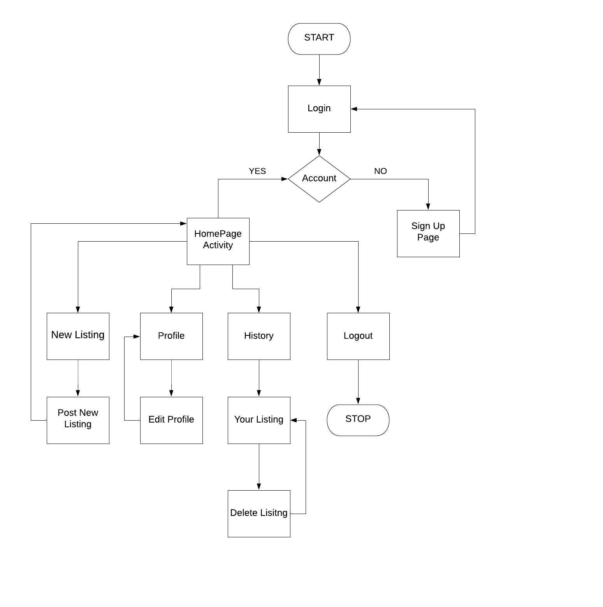

# Roommate-Finder

To use google places in the app, please follow below steps
1. create secrets.xml as a resource file under "RoommateFinder\app\src\main\res\values\secrets.xml"
2. add below code to secrets.xml

```
<?xml version="1.0" encoding="utf-8"?>
<resources>

    <string name="google_places_api_key">YOUR-API-KEY</string>
</resources>
```
3. replace YOUR-API-KEY with your google places API key in the above code snippet.
4. Now app is ready to use.

----------------------------------------------------------------------------------------------------------------------------------
This is an android app named Roommate finder.

Our App helps in finding a roommate in your area. It also helps in setting multiple preferences while searching for roommate. It gives an option to post your house if you already have a space to live or search for roommate who has living space to share with


We have a total of 9 activities:
1.	Login activity: 
2.	Sign Up activity: 
3.	User Profile: 
4.	Homepage activity:
5.	Listing detailed Info activity: 
6.	Roommate Info activity:
7.	New listing activity: 
8.	Filters activity: 
9.	Your listings activity: 
10. Search Results Activity

#### Team members: 
1.	Sai Jyothsna Mathi
2.	Omkar Abhiteja Badda
3.	Deepak Malempati
4.	Jeevan Reddy Mure
### Application Information:

  #### Test credentials:
  
  #### APK:
  
  #### Supported Devices:
      1. Android 5.0 Lollipop(API 21)-minimum sdk
      2. Android 6.0 Marshmallow(API 23) 
      3. Android 7.0 Nougat(API 24)  
      4. Android 8.0 Oreo(API 26)
      5. Android 9.0 Pie(API 28)-target sdk  
      6. Android 10(API 29)- copmile sdk  

  #### Sequence Information:
     Below Flow chart describes flow of information in sequence for RoomiE application.




